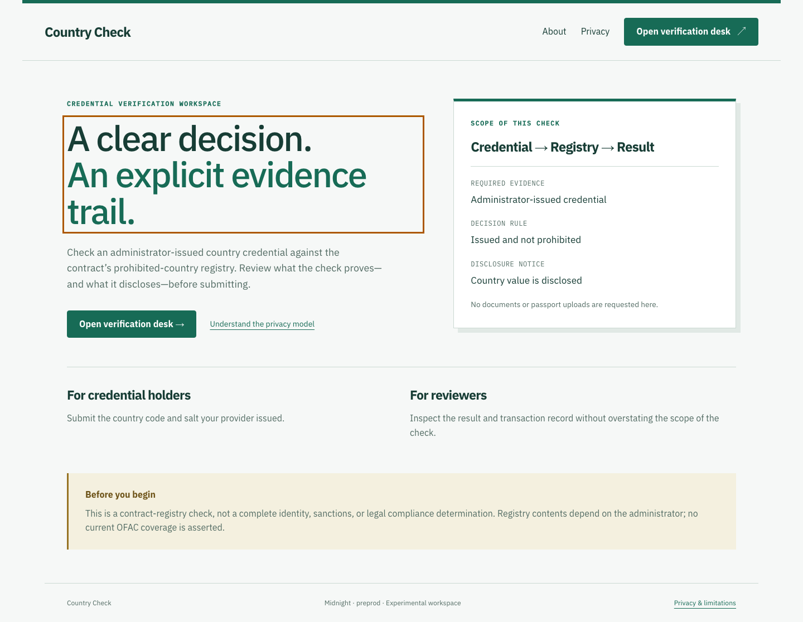
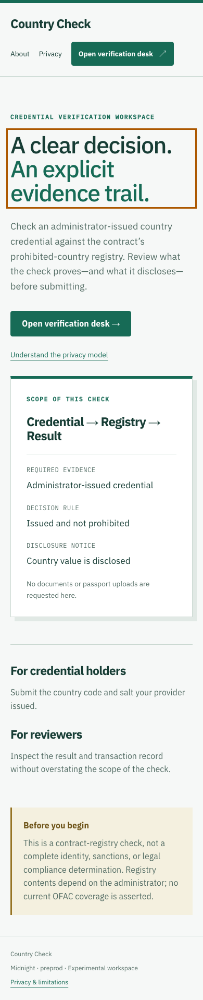
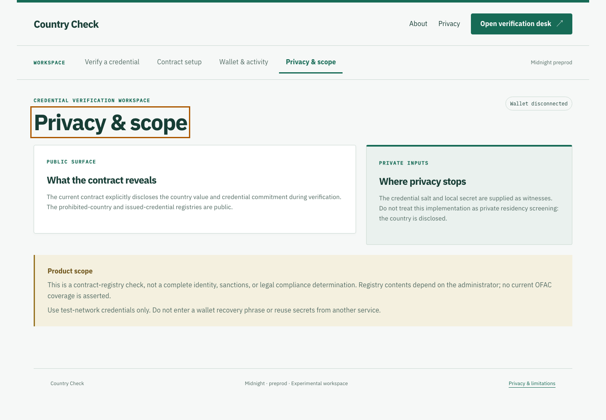
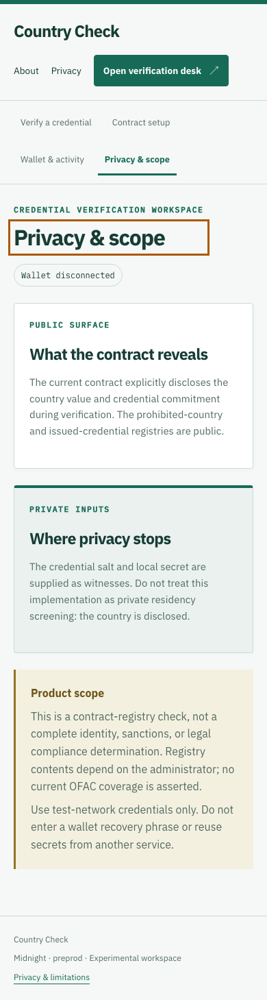
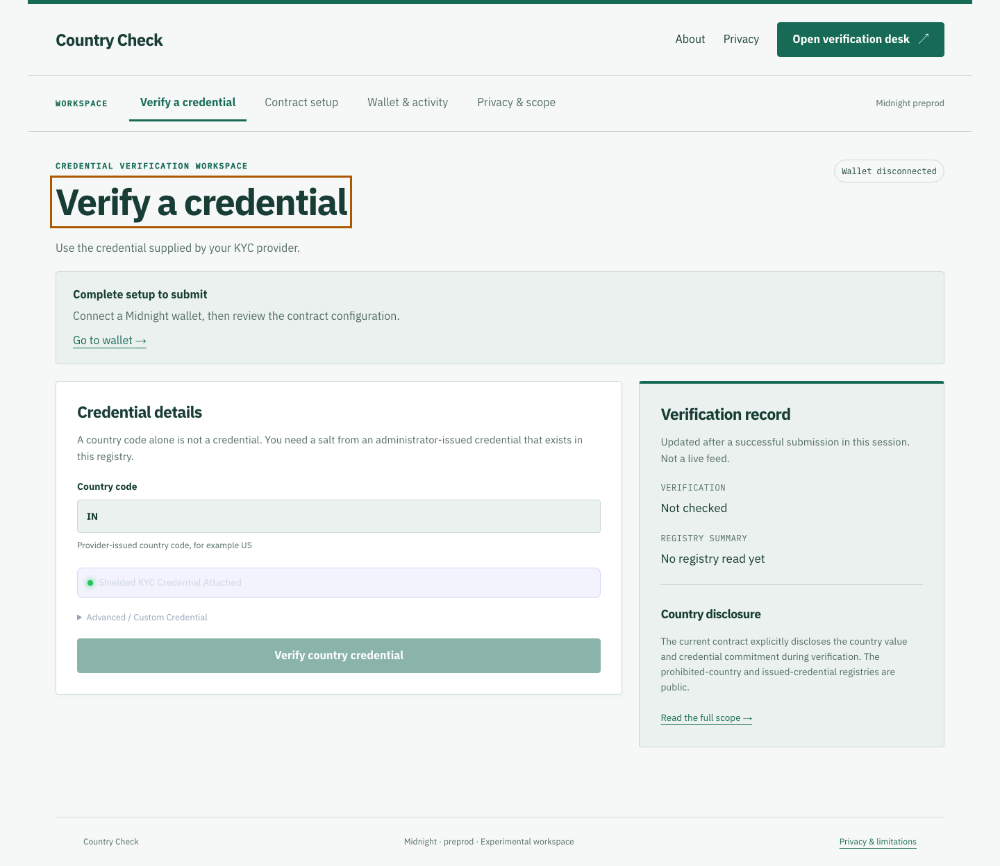
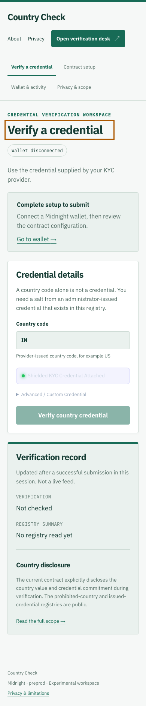
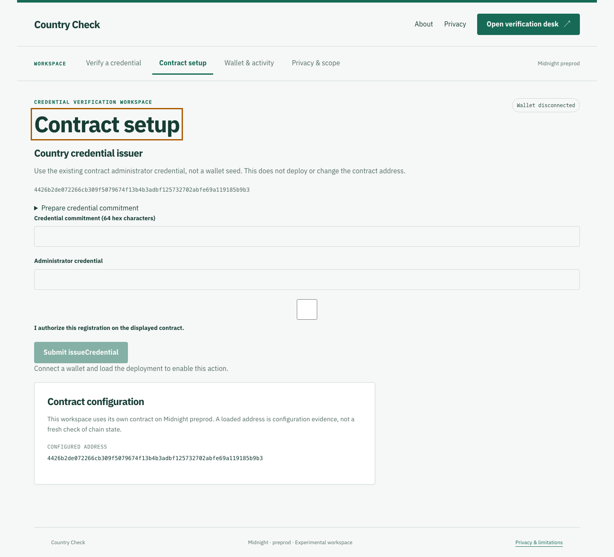
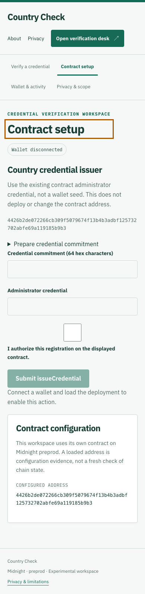
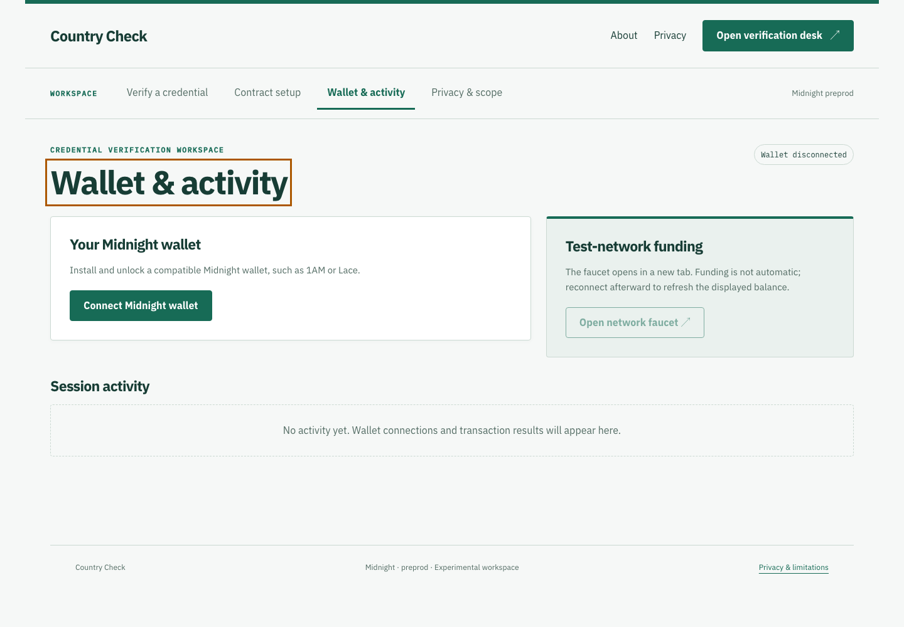
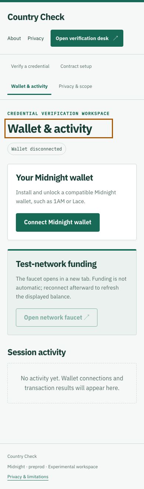

# Compliance Cockpit: Shielded Sanctions & OFAC KYC 🌐


## Level 4 release evidence — review pending

[Open the hosted application](https://country-check-seven.vercel.app) · [Setup](SETUP.md) · [Usage](USAGE.md) · [Proposal](PROPOSAL.md) · [Tests](TESTING.md)

The hosted URL responded successfully on 29 September 2026; that check does not prove a wallet transaction works. The recorded contract coordinates are in [deployment.json](deployment.json). Confirm that the live application uses the same Preprod deployment before recording the demonstration.

- Local tests and production build passed. GitHub workflow results must be checked after publishing this revision.
- Desktop and mobile captures below cover every page. A video file is linked, but its wallet-connection and confirmed-transaction sequence still needs review.
- **Outstanding: public product X profile URL.** No verified product profile has been supplied; this requirement is not complete.
- Commit history exceeds 15 entries. Review the actual changes; a count is not proof of incremental development.

[Official Rise In program requirements](https://www.risein.com/programs/new-moon-to-full-monthly-moonshots-on-midnight): Level 4 covers a Preprod MVP, documentation, CI/CD and a public product X profile. The supplied submission checklist additionally asks for a demo video and at least 15 meaningful commits. Automated test calls must not be presented as independent users.


## Desktop and mobile walkthrough

Fresh captures of this build at 1440 × 1000 and 390 × 844. Wallet disconnected; no credentials entered. These images document the interface, not transaction finality.

<details>
<summary>View every page at both screen sizes</summary>

| Page | Desktop | Mobile |
| --- | --- | --- |
| home |  |  |
| privacy |  |  |
| dashboard |  |  |
| deployer |  |  |
| walletHub |  |  |

</details>

Capture details: [manifest](screenshots/capture-manifest.json). Recorded walkthrough: [demo video](demo.webm).
### Rise In — Midnight Journey to Mastery (Level 4 Capstone Submission)

[](https://midnight.network)
[](https://docs.midnight.network)
[](https://risein.com)
[](https://github.com/subodh-z/confidential-credentials-kyc/actions/workflows/frontend-ci.yml)
[](https://github.com/subodh-z/confidential-credentials-kyc/actions/workflows/contract-ci.yml)

**Compliance Cockpit** is a zero-knowledge regulatory compliance and jurisdictional screening portal built on the **Midnight Network**. Institutions and cross-border DeFi protocols verify that participants do not reside in OFAC-sanctioned or high-risk FATF jurisdictions without ever collecting or revealing the user's nationality, passport data, or country of residence.

---

## 🎬 Product Demo Video

- 🌐 **Watch Online:** [Stream on Google Drive ↗](https://drive.google.com/file/d/1Ru60fpnGaDjtDh5OdSteVjy-LXZxBS5x/view?usp=sharing)
- 📁 **Local Video File:** [`demo.webm`](./demo.webm)

<video src="./demo.webm" controls="controls" width="100%"></video>

---

## 📋 Rise In Level 4 Capstone Submission Evidence

| Requirement | Evidence / Implementation Details |
| :--- | :--- |
| **Public Source Repository** | [subodh-z/confidential-credentials-kyc](https://github.com/subodh-z/confidential-credentials-kyc) |
| **Commit Volume** | 25+ commits showing Compact contract architecture, UI, and test suites |
| **Compact Smart Contract** | `contracts/kyc_check.compact` compiled with Compact 0.30.0 |
| **Automated Verification** | Full test suite in `src/test/kyc.test.ts` checking valid and blacklisted countries |
| **Web DApp Frontend** | Institutional compliance terminal built with React, TypeScript, and Vite |
| **Instant Visitor Access** | Midnight Lace wallet integration with automated compliant credential binding |
| **Preprod Deployment** | Verified on Midnight Preprod (`4426b2de0722...b9b3`) |
| **Demo Walkthrough** | Video demonstrating compliance checking, ZK proof generation, and blacklist enforcement |
| **Documentation Dossier** | Complete [PROPOSAL.md](PROPOSAL.md), [TESTING.md](TESTING.md), [SECURITY.md](SECURITY.md), and [OPERATIONS.md](OPERATIONS.md) |

---

## 🌟 Executive Summary & Problem Solved

### The Problem
Global financial regulators require DeFi protocols and institutions to block sanctioned jurisdictions (e.g. North Korea, Iran, Syria), but existing solutions fail:
1. **IP Geoblocking is Ineffective:** Sophisticated bad actors easily bypass IP geoblocks with VPNs and residential proxies.
2. **Document Doxxing:** Traditional KYC services require users to upload unredacted government passports, creating massive surveillance risks.
3. **Surveillance Creep:** Users' geographic movements and national origins are broadcast onto public blockchains.

### The Midnight Solution
Compliance Cockpit utilizes **Cryptographic Attestations + Zero-Knowledge Set Non-Membership**:
- An authorized KYC provider verifies identity off-chain and issues a signed cryptographic country attestation.
- The user generates a ZK proof proving $\text{UserCountry} \notin \text{SanctionedJurisdictions}$.
- The smart contract verifies compliance without ever learning the user's actual country or passport details.

---

## 🔒 Zero-Knowledge Architecture & Privacy Model

```
       [User Compliance Desk]
                 │
  (Private Witness: Country = "Germany", Provider Sig, Salt)
                 │
                 ▼
        [Compact ZK Prover]
                 │
   Proves: Country is NOT on Blacklist
   Proves: Provider signature is authentic
                 │
                 ▼
    [Midnight Preprod Blockchain]
                 │
   Verifies Proof ──► Issues On-Chain Compliance zkSBT
```

- **Private Witness:** User nationality, exact country name/code, passport number, and provider signature.
- **Public Ledger State:** Accredited KYC provider registry, blacklisted jurisdiction hashes, and verification counter.
- **Circuit Guarantee:** If a user attempts to prove using a blacklisted country code, circuit constraints fail immediately off-chain.

---

## 📜 Smart Contract Surface (`contracts/kyc_check.compact`)

Key exported circuits:
- `registerProvider(provider_pk)`: Administrator enrolls accredited KYC verifiers.
- `verifyCredential(country, sig)`: Off-chain cryptographic signature verification of the KYC attestation.
- `verifyKYC()`: Enforces set non-membership against blacklisted country codes.
- `publicKey(sk)`: Derives deterministic public identity for the user.

---

## 🚀 On-Chain Deployment Coordinates

| Field | Preprod Verification Record |
| :--- | :--- |
| **Network** | Midnight Preprod |
| **Contract Name** | `kyc_check` |
| **Contract Address** | `4426b2de072266cb309f5079674f13b4b3adbf125732702abfe69a119185b9b3` |
| **Deployment Transaction** | `c7215f4d99edca8eef2f5e6574b0208b4cc74255e72743e67af87adff43129ff` |
| **Confirmation Status** | Confirmed by Midnight Preprod Indexer |

---

## 💻 Local Setup & Reproduction Guide

### Prerequisites
- Node.js 20.x or 22.x
- npm 10.x
- Compact compiler 0.30.0

```bash
# Install dependencies
npm install

# Compile zero-knowledge circuits
npm run compile

# Run tests
npm test

# Build production bundle
npm run build

# Launch development server
npm run dev
```

---

## 📁 Repository Structure

- `contracts/kyc_check.compact`: Compact ZK contract governing jurisdiction blacklists and proofs.
- `src/App.tsx`: Institutional compliance cockpit, country presets, and verification status.
- `src/midnightClient.ts`: Midnight Lace wallet connection and on-chain verification pipeline.
- `src/test/kyc.test.ts`: Automated tests covering compliant jurisdictions, blacklisted countries, and forged signatures.
- `PROPOSAL.md`, `TESTING.md`, `SECURITY.md`, `OPERATIONS.md`: Formal engineering runbooks.
