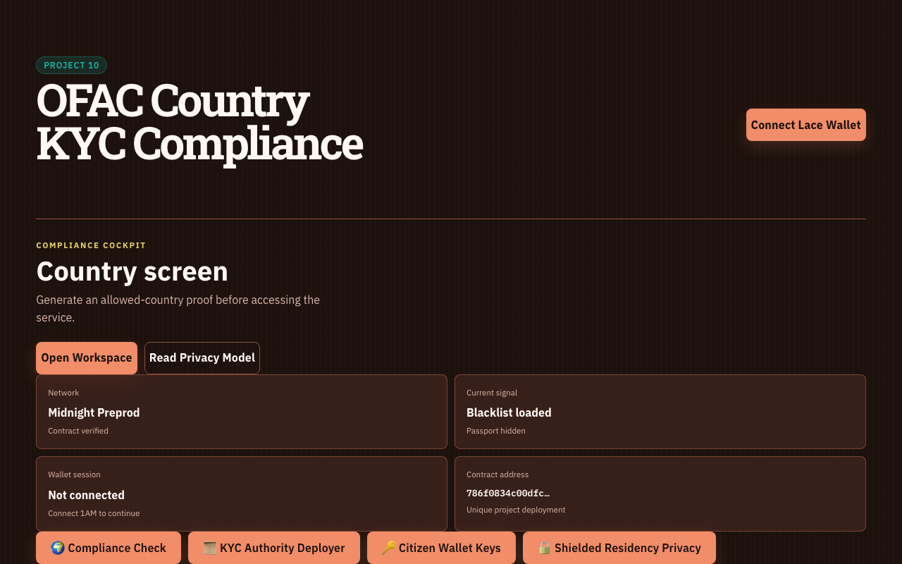
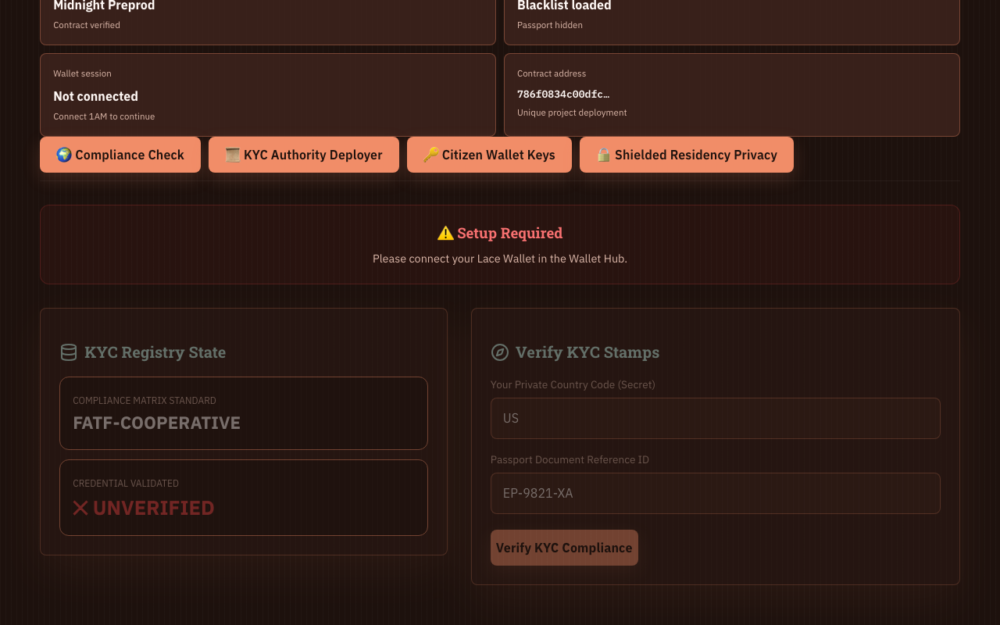
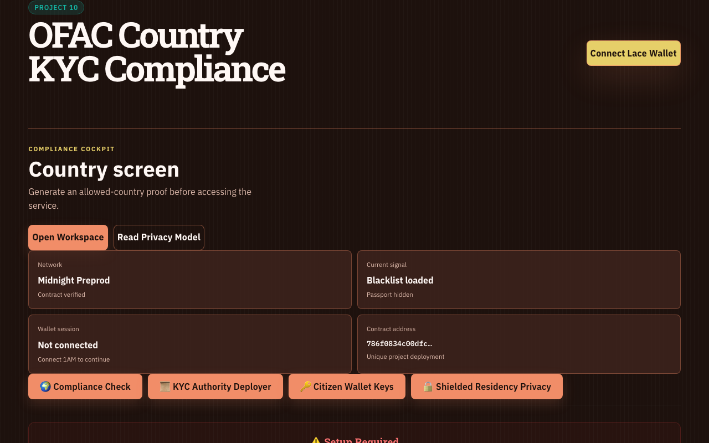

# OFAC Country KYC Compliance

 

A privacy-first compliance cockpit that proves an applicant is outside a prohibited-country policy without publishing their country, passport reference, or complete KYC record.

## Auditor entry points

**Idea:** [PROPOSAL.md](./PROPOSAL.md) · **Executable compliance suite:** [src/test/kyc.test.ts](./src/test/kyc.test.ts) · **Verification matrix:** [TESTING.md](./TESTING.md) · **Preview evidence:** [deployment.json](./deployment.json)

## Product

Traditional country screening reveals far more identity data than a service needs. This application reduces the decision to a selective-disclosure proof:

1. an operator registers trusted KYC providers;
2. prohibited countries are represented by public commitments;
3. the applicant keeps country and credential witnesses in wallet-local state;
4. the `verifyKYC` circuit proves that a trusted provider issued the credential and the country is not prohibited;
5. the UI displays the confirmed Midnight result and deployment identity.

The burnt-orange cockpit is intentionally distinct from the other Midnight applications: it uses a regulatory operations language, a country-screen workflow, and an explicit public/private evidence split.

## Midnight Preview deployment

| Field | Value |
| --- | --- |
| Network | Midnight Preview |
| Contract | `kyc_check` |
| Contract address | `33fe17c53bfb7ecb08246f078d64bc71f5799a4e6dd3cd508fc0aeb6ab11fd55` |
| Deployment transaction | `00dc146bff84b28e470cb9ec5ea7f737bec808185df0ce739ceb32c9d3bcd30088` |
| Compliance deployer | `mn_addr_preview176gx8nm3xjt50mygm9srn5wkez09umg8jss5huqckmcxz8hhq42sxg7fvw` |
| Confirmation time | `2026-08-03T19:08:56.741Z` |
| Verification | Confirmed by Midnight Preview indexer |

Machine-readable deployment evidence is stored in [`deployment.json`](./deployment.json). The same manifest is copied into the production frontend through `public/deployment.json`.

## Privacy is the core feature

Public and auditable:

- trusted KYC provider registry;
- prohibited-country commitments;
- contract address and confirmed transactions;
- allowed/not-allowed policy outcome.

Private witness data:

- exact country;
- KYC credential witness;
- passport reference;
- wallet-local secret material.

The application proves policy compliance without publishing which allowed country the applicant used. It does not place recovery phrases, wallet files, or raw passport records in the repository.

## Compact contract

Source: [`contracts/kyc_check.compact`](./contracts/kyc_check.compact)

| Circuit | Purpose |
| --- | --- |
| `registerKYCProvider(provider_pk)` | Adds a provider after administrator authorization. |
| `registerProhibitedCountry(country_hash)` | Adds a country commitment after administrator authorization. |
| `verifyKYC()` | Checks trusted-provider membership and rejects prohibited-country membership. |
| `publicKey(sk)` | Derives the administrator authorization key. |

The current credential witness is a testnet-oriented 32-byte issuer assertion checked against the trusted-provider registry. Production adoption would require a hardened credential-signature format, revocation, and independent cryptographic review.

## Verification

```bash
npm ci
npm test
npm run compile
npm run build
```

The simulator-backed suite at `src/test/kyc.test.ts` contains five passing positive and negative scenarios. See [TESTING.md](./TESTING.md) for the complete checklist and [PROPOSAL.md](./PROPOSAL.md) for the product submission.

CI/CD is split by responsibility:

- Frontend CI type-checks and creates the production Vite bundle.
- Compact CI compiles `kyc_check.compact` and runs the contract tests.
- Dependency Audit creates a scheduled security artifact.
- Release automation publishes frontend, generated contract, and deployment artifacts for version tags.

See [AUTOMATION.md](./AUTOMATION.md) for operational details.

The automation pins Compact compiler `0.30.0`, matching `@midnight-ntwrk/compact-runtime` `0.15.0`, so generated circuits and the TypeScript simulator use the same runtime ABI.

## Repository structure

```text
.
├── .github/workflows/       frontend, contract, audit, and release automation
├── contracts/
│   ├── kyc_check.compact    privacy contract source
│   └── managed/kyc_check/   generated contract and proving assets
├── public/
│   └── deployment.json      runtime deployment manifest
├── screenshots/             dashboard and privacy evidence
├── src/
│   ├── test/                five simulator-backed contract tests
│   ├── App.tsx              compliance cockpit
│   ├── midnightClient.ts    wallet, provider, deployment, and call integration
│   └── witnesses.ts         wallet-local private witness bindings
├── deployment.json          Preview deployment evidence
├── PROPOSAL.md              product idea submission
└── TESTING.md               judge-facing verification manifest
```

## Local configuration

Compliance test wallets obtain tNight from the [official Midnight Preview faucet](https://faucet.preview.midnight.network/).

```bash
cp .env.example .env.local
npm ci
npm run dev
```

Use a compatible Midnight Preview wallet such as 1AM or Lace. The browser loads proving and verifier assets from the generated `contracts/managed/kyc_check` output. Live deployment requires a synchronized funded wallet, DUST, and a reachable proof server.

## Screenshots

| Compliance cockpit | Circuit execution |
|:---:|:---:|
|  |  |

| Ledger evidence | Privacy model |
|:---:|:---:|
|  |  |

## Demo

[Watch the OFAC Country KYC Compliance walkthrough](https://drive.google.com/file/d/1Ru60fpnGaDjtDh5OdSteVjy-LXZxBS5x/view?usp=sharing).

This is a Midnight Preview prototype, not legal advice or a production KYC decision engine.

## Compliance operations

Before operating OFAC Country KYC Compliance, read the independent [security model](SECURITY.md) and [operations runbook](OPERATIONS.md). Runtime configuration is fail-closed and its executable checks live in [src/test/runtime-config.test.ts](src/test/runtime-config.test.ts).
